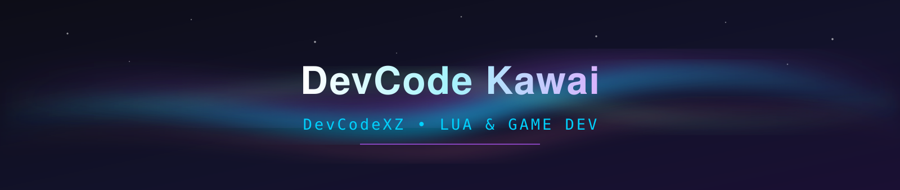
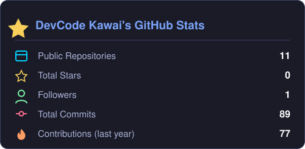
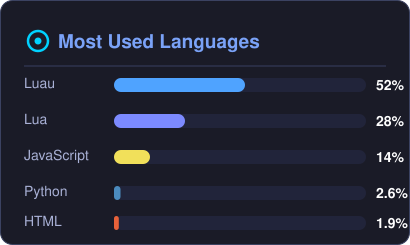

<div align="center">



[](https://github.com/DevCodeXZ)

[](https://github.com/DevCodeXZ)

</div>

## ⚡ About me

```lua
local DevCode = {
    name     = "DevCode Kawai",
    loves    = "LUA CODE <3",
    focus    = { "Roblox scripts", "UI libraries", "Obfuscators", "Web games" },
    building = "🦆 Pantano de Patos — Three.js shooter-tycoon",
    vibe     = "low-poly · neon · duck-powered",
}
```

## 🛠️ Tech stack

<div align="center">


</div>

## 📊 GitHub stats

<div align="center">

&nbsp;&nbsp;


</div>

## 🏆 Featured projects

| 🦆 [**pantano-de-patos**](https://github.com/DevCodeXZ/pantano-de-patos) | 🔒 [**aurorax-obfuscator**](https://github.com/DevCodeXZ/aurorax-obfuscator) | 🌈 [**Aurora-X-Ui-library**](https://github.com/DevCodeXZ/Aurora-X-Ui-library) |
|---|---|---|
| *Shooter-tycoon 3D low-poly: caza patos, mejora tu rifle y tu perro, sobrevive 100 días y derrota a los 10 jefes del pantano.* `Three.js` `HTML5` | *Obfuscator for Lua scripts with an embedded VM runtime. Lua 5.1+ / LuaJIT compatible.* `Python` `Lua` | *Librería de interfaz para Roblox escrita en Luau.* `Luau` |

## 🐍 Contribution snake

<div align="center">

<picture>
  <source media="(prefers-color-scheme: dark)" srcset="https://raw.githubusercontent.com/DevCodeXZ/DevCodeXZ/output/github-contribution-grid-snake-dark.svg" />
  <source media="(prefers-color-scheme: light)" srcset="https://raw.githubusercontent.com/DevCodeXZ/DevCodeXZ/output/github-contribution-grid-snake.svg" />
  
</picture>

</div>

<div align="center">


</div>
